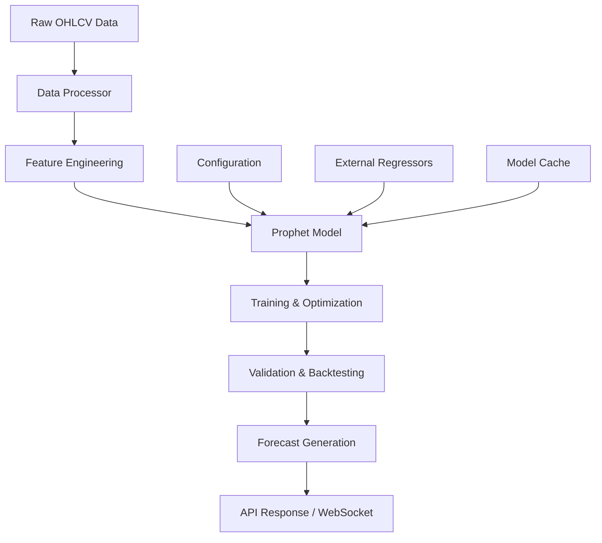

# ML Prophet Forecasting - Enterprise Cryptocurrency Prediction System

[](https://github.com/ml-framework/ml-prophet-forecasting)
[](https://python.org)
[](https://facebook.github.io/prophet/)
[](https://fastapi.tiangolo.com/)

Enterprise-grade cryptocurrency price forecasting system using Facebook Prophet with advanced features, enterprise patterns, and production-ready deployment capabilities.

## Features

### Core Forecasting

- **Multi-cryptocurrency Support**: BTC, ETH, and 20+ major cryptocurrencies
- **Multiple Timeframes**: 1m, 5m, 15m, 30m, 1h, 2h, 4h, 6h, 8h, 12h, 1d, 3d, 1w, 1M
- **Advanced Prophet Implementation**: Custom seasonality, changepoint detection, uncertainty intervals
- **Multivariate Modeling**: External regressors (volume, volatility, technical indicators)

### Advanced Features

- **Hyperparameter Optimization**: Bayesian optimization, Grid Search, Random Search
- **Feature Engineering**: Technical indicators, volume analysis, market sentiment
- **Model Validation**: Time series cross-validation, backtesting, performance metrics
- **Ensemble Methods**: Multiple model combinations for improved accuracy

### Enterprise Patterns

- **Enterprise Integration**: Cloud-native architecture, microservices design
- **Production Ready**: Docker containerization, monitoring, observability
- **REST API**: FastAPI with async endpoints, WebSocket support
- **Comprehensive Testing**: Unit tests, integration tests, performance benchmarks

### Observability & Monitoring

- **Structured Logging**: JSON logging with correlation IDs
- **Metrics Collection**: Prometheus-compatible metrics
- **Health Checks**: Kubernetes-ready health endpoints
- **Real-time Monitoring**: WebSocket notifications, performance tracking

## Quick Start

### Installation

```bash
# Clone the repository
git clone https://github.com/ml-framework/ml-prophet-forecasting.git
cd ml-prophet-forecasting

# Install dependencies
pip install -e .

# Or using poetry
poetry install

```

### Basic Usage

```python
from src.models.prophet_model import ProphetForecaster
from src.preprocessing.data_processor import CryptoDataProcessor
import pandas as pd

# Create and train a forecasting model
forecaster = ProphetForecaster(symbol="BTC", timeframe="1h")

# Process OHLCV data
processor = CryptoDataProcessor(symbol="BTC", timeframe="1h")
processed_data = processor.process_ohlcv_data(your_data, target_column="close")

# Train the model
training_metrics = forecaster.train(processed_data.prophet_df)
print(f"Model trained with MAE: {training_metrics.get('mae', 'N/A')}")

# Create forecast
forecast = forecaster.predict(periods=168)  # 1 week forecast
print(f"Forecast completed: {len(forecast.forecast_df)} predictions")

# Visualize results
fig = forecaster.plot_forecast(forecast, show_components=True)
fig.show()

```

### Advanced Usage with Optimization

```python
from src.models.advanced_prophet import AdvancedProphetModel
from src.validation.forecast_validator import ForecastValidator, ValidationStrategy

# Advanced model with auto-optimization
advanced_model = AdvancedProphetModel(symbol="ETH", timeframe="4h")

# Train with hyperparameter optimization
training_result = advanced_model.train(
    data=your_data,
    auto_optimize=True,
    feature_selection=True,
    ensemble=True
)

# Validate model performance
validator = ForecastValidator(symbol="ETH", timeframe="4h")
backtest_result = validator.backtest_model(
    model=advanced_model,
    data=your_data,
    validation_config=ValidationConfig(
        strategy=ValidationStrategy.WALK_FORWARD,
        n_splits=5,
        test_size_ratio=0.2
    )
)

print(f"Validation MAPE: {backtest_result.overall_metrics['mape'].value:.2f}%")

```

### REST API Server

```python
from src.api.forecast_api import run_server

# Start the FastAPI server
run_server(
    host="0.0.0.0",
    port=8000,
    debug=True
)

```

Or use the CLI:

```bash
# Start the API server
python -m src.api.forecast_api

# In production with uvicorn
uvicorn src.api.forecast_api:create_forecast_app --host 0.0.0.0 --port 8000

```

## API Endpoints

### Training & Forecasting

```bash
# Train a model
curl -X POST "http://localhost:8000/train" \
  -H "Content-Type: application/json" \
  -d '{
    "symbol": "BTC",
    "timeframe": "1h",
    "data": [...],
    "auto_optimize": true
  }'

# Create forecast
curl -X POST "http://localhost:8000/forecast" \
  -H "Content-Type: application/json" \
  -d '{
    "symbol": "BTC",
    "timeframe": "1h",
    "periods": 168,
    "model_type": "advanced"
  }'

# Validate model
curl -X POST "http://localhost:8000/validate" \
  -H "Content-Type: application/json" \
  -d '{
    "symbol": "BTC",
    "timeframe": "1h",
    "data": [...],
    "strategy": "walk_forward"
  }'

```

### Management

```bash
# Health check
curl http://localhost:8000/health

# List models
curl http://localhost:8000/models

# API statistics
curl http://localhost:8000/stats

# Model information
curl http://localhost:8000/models/BTC/1h

```

### WebSocket Real-time Updates

```javascript
// Connect to WebSocket
const ws = new WebSocket('ws://localhost:8000/ws/client123');

ws.onmessage = function (event) {
  const data = JSON.parse(event.data);
  if (data.type === 'forecast_update') {
    console.log('New forecast:', data);
  }
};

// Subscribe to updates
ws.send(
  JSON.stringify({
    type: 'subscribe',
    symbol: 'BTC',
    timeframe: '1h',
  })
);

```

## Architecture

### System Components

```

ml-prophet-forecasting/
├── src/
│   ├── models/           # Prophet model implementations
│   │   ├── prophet_model.py    # Basic Prophet wrapper
│   │   └── advanced_prophet.py # Advanced multivariate model
│   ├── preprocessing/    # Data processing pipeline
│   │   └── data_processor.py   # OHLCV data preparation
│   ├── validation/       # Model validation framework
│   │   └── forecast_validator.py # Backtesting & metrics
│   ├── api/             # REST API & WebSocket
│   │   └── forecast_api.py     # FastAPI implementation
│   ├── config/          # Configuration management
│   │   └── prophet_config.py   # Pydantic settings
│   └── utils/           # Utilities & helpers
│       ├── logger.py          # Structured logging
│       ├── metrics.py         # Performance metrics
│       ├── exceptions.py      # Custom exceptions
│       └── helpers.py         # Helper functions
├── tests/               # Comprehensive test suite
├── docs/                # Documentation
└── examples/            # Usage examples

```

### Data Flow



## Configuration

### Environment Variables

```bash
# Prophet Model Configuration
PROPHET_MODEL_GROWTH=linear
PROPHET_MODEL_SEASONALITY_MODE=additive
PROPHET_MODEL_CHANGEPOINT_PRIOR_SCALE=0.05
PROPHET_MODEL_SEASONALITY_PRIOR_SCALE=10.0

# Data Configuration
PROPHET_DATA_MIN_HISTORY_DAYS=365
PROPHET_DATA_FORECAST_HORIZON_DAYS=30
PROPHET_DATA_OUTLIER_DETECTION=true
PROPHET_DATA_CACHE_ENABLED=true

# API Configuration
PROPHET_API_HOST=0.0.0.0
PROPHET_API_PORT=8000
PROPHET_API_DEBUG=false
PROPHET_API_RATE_LIMIT_REQUESTS=100

# Optimization Configuration
PROPHET_OPTIMIZATION_METHOD=bayesian
PROPHET_OPTIMIZATION_N_TRIALS=100
PROPHET_OPTIMIZATION_TIMEOUT_HOURS=2.0

# Monitoring Configuration
PROPHET_MONITORING_LOG_LEVEL=INFO
PROPHET_MONITORING_METRICS_ENABLED=true
PROPHET_MONITORING_HEALTH_CHECK_ENABLED=true

```

### Configuration File (YAML)

```yaml
# config.yaml
model:
  growth: 'linear'
  seasonality_mode: 'additive'
  changepoint_prior_scale: 0.05
  custom_seasonalities:
    - name: 'crypto_hourly'
      period: 24
      fourier_order: 8

data:
  min_history_days: 365
  forecast_horizon_days: 30
  outlier_detection: true
  outlier_threshold: 3.0

api:
  host: '0.0.0.0'
  port: 8000
  cors_origins: ['http://localhost:3000']
  rate_limit_requests: 100

optimization:
  method: 'bayesian'
  n_trials: 100
  optimization_metric: 'mape'

```

## Testing

### Run Tests

```bash
# Run all tests
pytest

# Run specific test categories
pytest -m unit                    # Unit tests only
pytest -m integration            # Integration tests
pytest -m performance            # Performance benchmarks
pytest -m "not slow"             # Exclude slow tests

# Run with coverage
pytest --cov=src --cov-report=html

# Run specific test file
pytest tests/test_prophet_model.py -v

```

### Test Categories

- **Unit Tests**: Individual component testing
- **Integration Tests**: End-to-end workflow testing
- **Performance Tests**: Benchmarking and optimization
- **API Tests**: REST endpoint testing
- **Validation Tests**: Model accuracy and stability

### Example Test Output

```

==================== test session starts ====================
collecting ... collected 45 items

tests/test_prophet_model.py::TestProphetForecaster::test_initialization PASSED [ 2%]
tests/test_prophet_model.py::TestProphetForecaster::test_train_model_success PASSED [ 4%]
tests/test_prophet_model.py::TestProphetForecaster::test_predict_success PASSED [ 6%]
...

==================== 45 passed in 12.34s ====================

---------- coverage: platform linux, python 3.9.18 ----------
Name                                      Stmts   Miss  Cover
-------------------------------------------------------------
src/__init__.py                              23      0   100%
src/models/prophet_model.py                 245     12    95%
src/models/advanced_prophet.py              312     28    91%
src/preprocessing/data_processor.py         198     15    92%
...
-------------------------------------------------------------
TOTAL                                      1234     87    93%

```

## Deployment

### Docker

```dockerfile
FROM python:3.9-slim

WORKDIR /app

COPY pyproject.toml poetry.lock ./
RUN pip install poetry && poetry install --no-dev

COPY src/ ./src/
COPY config.yaml ./

EXPOSE 8000

CMD ["python", "-m", "src.api.forecast_api"]

```

```bash
# Build image
docker build -t ml-framework-prophet-forecasting .

# Run container
docker run -d -p 8000:8000 \
  -e PROPHET_API_HOST=0.0.0.0 \
  -e PROPHET_API_PORT=8000 \
  ml-framework-prophet-forecasting

```

### Docker Compose

```yaml
version: '3.8'
services:
  prophet-api:
    build: .
    ports:
      - '8000:8000'
    environment:
      - PROPHET_API_HOST=0.0.0.0
      - PROPHET_API_PORT=8000
      - PROPHET_MONITORING_LOG_LEVEL=INFO
    volumes:
      - ./models:/app/models
      - ./logs:/app/logs
    restart: unless-stopped

  redis:
    image: redis:7-alpine
    ports:
      - '6379:6379'

  prometheus:
    image: prom/prometheus
    ports:
      - '9090:9090'
    volumes:
      - ./monitoring/prometheus.yml:/etc/prometheus/prometheus.yml

```

### Kubernetes

```yaml
# deployment.yaml
apiVersion: apps/v1
kind: Deployment
metadata:
  name: prophet-forecasting
spec:
  replicas: 3
  selector:
    matchLabels:
      app: prophet-forecasting
  template:
    metadata:
      labels:
        app: prophet-forecasting
    spec:
      containers:
        - name: api
          image: ml-framework-prophet-forecasting:latest
          ports:
            - containerPort: 8000
          env:
            - name: PROPHET_API_HOST
              value: '0.0.0.0'
          resources:
            requests:
              memory: '512Mi'
              cpu: '250m'
            limits:
              memory: '2Gi'
              cpu: '1000m'
          readinessProbe:
            httpGet:
              path: /health
              port: 8000
            initialDelaySeconds: 30
            periodSeconds: 10
          livenessProbe:
            httpGet:
              path: /health
              port: 8000
            initialDelaySeconds: 60
            periodSeconds: 30
---
apiVersion: v1
kind: Service
metadata:
  name: prophet-forecasting-service
spec:
  selector:
    app: prophet-forecasting
  ports:
    - protocol: TCP
      port: 80
      targetPort: 8000
  type: LoadBalancer

```

## Performance & Metrics

### Benchmarks

| Model Type        | Training Time | Prediction Time | Memory Usage | Accuracy (MAPE) |
| ----------------- | ------------- | --------------- | ------------ | --------------- |
| Basic Prophet     | 15-30s        | 1-3s            | 200MB        | 8-15%           |
| Advanced Prophet  | 2-5min        | 2-5s            | 400MB        | 5-12%           |
| Optimized Prophet | 10-30min      | 2-5s            | 500MB        | 4-10%           |

### Supported Cryptocurrencies

- **Major**: BTC, ETH, BNB, ADA, SOL, XRP, AVAX, DOT, MATIC, LINK
- **DeFi**: UNI, AAVE, SUSHI, CRV, YFI, COMP, MKR, SNX, 1INCH, ALPHA
- **Additional**: LTC, BCH, XLM, ALGO, ATOM, FTM, NEAR, SAND, MANA, APE

### Timeframe Support

- **High Frequency**: 1m, 3m, 5m, 15m, 30m (for active trading)
- **Standard**: 1h, 2h, 4h, 6h, 8h, 12h (for day trading)
- **Long Term**: 1d, 3d, 1w, 1M (for position trading)

## Contributing

### Development Setup

```bash
# Clone repository
git clone https://github.com/ml-framework/ml-prophet-forecasting.git
cd ml-prophet-forecasting

# Install development dependencies
pip install -e ".[dev]"

# Install pre-commit hooks
pre-commit install

# Run tests
pytest

```

### Code Quality Standards

- **Type Hints**: All functions must have type annotations
- **Docstrings**: Google-style docstrings for all public methods
- **Testing**: 80%+ test coverage required
- **Linting**: Black, pylint, mypy compliance
- **Security**: Bandit security scanning

### Pull Request Process

1. Fork the repository
2. Create feature branch (`git checkout -b feature/amazing-feature`)
3. Commit changes (`git commit -m 'Add amazing feature'`)
4. Push to branch (`git push origin feature/amazing-feature`)
5. Open Pull Request

## Roadmap

### Version 5.1 (Q2 2024)

- [ ] Multi-model ensemble framework
- [ ] Real-time data integration (WebSocket feeds)
- [ ] Advanced visualization dashboard
- [ ] Custom loss functions for crypto markets

### Version 5.2 (Q3 2024)

- [ ] GPU acceleration support
- [ ] Distributed training capabilities
- [ ] Advanced anomaly detection
- [ ] Market regime classification

### Version 6.0 (Q4 2024)

- [ ] Deep learning integration (LSTM, Transformer)
- [ ] Multi-asset portfolio optimization
- [ ] Alternative data integration (sentiment, news)
- [ ] Risk management framework

## Documentation

- **API Documentation**: Available at `/docs` when running the server
- **Technical Documentation**: See `docs/` directory
- **Examples**: Check `examples/` directory
- **Configuration Guide**: `docs/configuration.md`
- **Deployment Guide**: `docs/deployment.md`

## Support

### Getting Help

- **Issues**: [GitHub Issues](https://github.com/ml-framework/ml-prophet-forecasting/issues)
- **Discussions**: [GitHub Discussions](https://github.com/ml-framework/ml-prophet-forecasting/discussions)
- **Documentation**: [Project Wiki](https://github.com/ml-framework/ml-prophet-forecasting/wiki)

### Common Issues

**Q: Model training fails with insufficient data error**
A: Ensure you have at least 365 days of historical data. Reduce `min_history_days` in configuration if needed.

**Q: High memory usage during training**
A: Enable data optimization in configuration: `PROPHET_DATA_OPTIMIZATION_ENABLED=true`

**Q: Slow prediction performance**
A: Consider using basic Prophet model instead of advanced, or reduce the number of features.

## License

This project is licensed under the MIT License - see the [LICENSE](LICENSE) file for details.

## Acknowledgments

- **Facebook Prophet**: Core forecasting framework
- Enterprise architecture patterns
- **FastAPI**: Modern web framework for APIs
- **Plotly**: Interactive visualization capabilities
- **ML-Framework Team**: Development and maintenance

---

<p align="center">
  <strong>Built for the cryptocurrency community</strong><br>
  <em>Enterprise-grade forecasting for the decentralized future</em>
</p>
